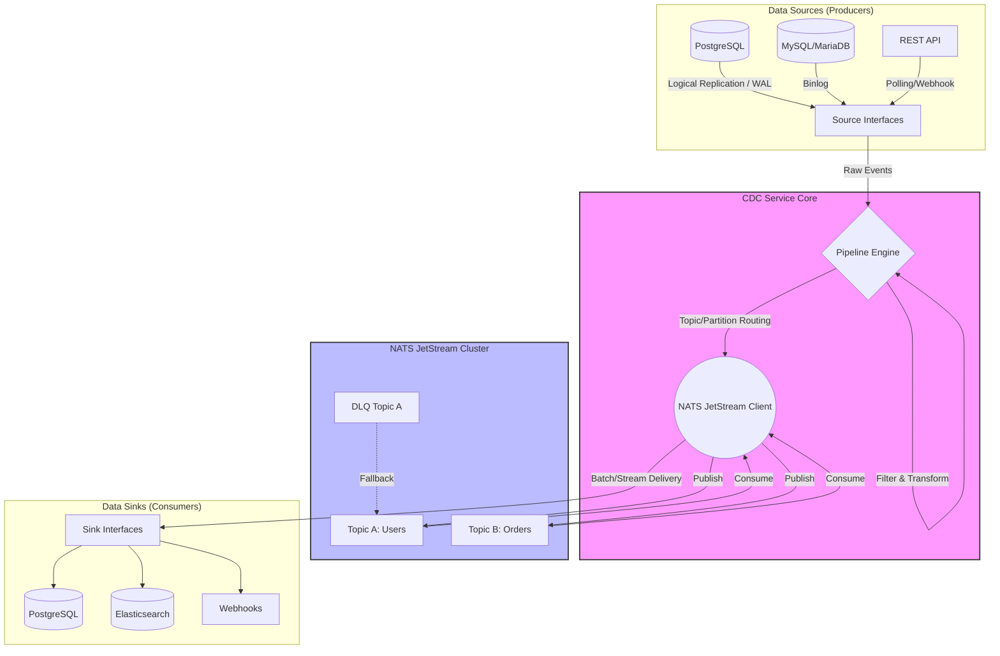

# High-Performance Change Data Capture (CDC) System

## Overview

This is a robust, scalable, and highly available Change Data Capture (CDC) system built in Go. It enables real-time data streaming from various source databases (PostgreSQL, MySQL, MariaDB) and REST APIs, routes them through a flexible pipeline engine, stores them reliably using NATS JetStream, and finally delivers them to various sinks (PostgreSQL, Elasticsearch, Webhooks).

## System Architecture

The CDC ecosystem is logically partitioned into **Sources**, a **Pipeline Engine**, a **Message Bus (NATS)**, and **Sinks**.



## Core Components

### 1. Sources
Sources connect to external systems and capture data changes in real-time.
- **PostgreSQL**: Connects via logical replication (e.g., `pgoutput`) to stream WAL (Write-Ahead Log) changes.
- **MySQL / MariaDB**: Connects via replication protocols to stream Binlog events. Guarantees message ordering and smooth recovery upon disconnects.
- **REST API**: Periodically polls external APIs for new data.

### 2. Pipeline Engine
The brain of the CDC service that dictates how data moves from *A to B*.
- **Transformation & Filtering**: Modifies raw payloads and drops unwanted events.
- **Routing logic (N-to-N)**: A single topic can receive data from multiple sources. Multiple sinks can consume from exactly the same topic independently, enabling fan-in and fan-out architectural patterns.

### 3. Message Broker (NATS JetStream)
Provides guaranteed message delivery, durability, and exactly-once semantics.
- **Topics & Partitions**: Events are logically grouped. For example, `db.users` or `db.orders`.
- **Consumer Management**: Supports idempotent consumer tracking to prevent duplicate processing ensuring strictly ordered message delivery.
- **Dead Letter Queue (DLQ)**: Failed message processing attempts are routed to a DLQ so that the main pipeline continues functioning. These can be inspected and re-processed manually via the API.

### 4. Sinks
Consumers that push structured events into target data stores.
- **PostgreSQL**: Upserts data securely into tables.
- **Elasticsearch**: Indexes documents for heavy text-search capabilities.
- **Webhooks**: Pushes JSON payloads directly to an HTTP endpoint.

### 5. Management API
A gRPC-based management API (`cdc.proto`) providing control-plane capabilities:
- Register, Read, Update, and Delete `Sources` and `Sinks` dynamically.
- Discover and monitor active topics and partitions.
- Manage message streams with the **Message Explorer**, which offers pagination-based retrieval (limit, page), sorting, and detailed status filtering (Sent vs. Unsent).
- Monitor pipeline processing offsets and un-acked fallback messages.

## General Data Flow (The Lifecycle of an Event)

1. **Capture**: A database transaction occurs (e.g., `INSERT INTO users`). The configured `Source` captures this event via Binlog/WAL.
2. **Ingestion**: The event is passed to the `PipelineEngine` containing metadata (table name, timestamp, sequence tracker).
3. **Routing**: The Engine transforms the event (if needed) and maps it to a specific `Topic` (e.g., `CDC.db.users`) and `Partition`.
4. **Publishing**: The Engine publishes the event into `NATS JetStream`. The broker safely persists the data to disk.
5. **Consumption**: Independent `Sink` workers, acting as NATS Consumers, pull the event from the broker. Each sink tracks its own offset/ACK floor to realize exactly-once delivery dynamically. 
6. **Processing**: The `Sink` writes the object to its destination (e.g., sending it to Elasticsearch).
7. **Acknowledgement**: Once the write succeeds, the `Sink` acknowledges (ACKs) the message in NATS. If execution fails consecutively, the message drops into the DLQ.

## Project Structure
```text
.
├── api/
│   └── proto/v1/   # gRPC Protobuf definitions (cdc.proto)
├── cmd/cdc/        # Application entrypoint
├── pkg/
│   ├── config/     # Dynamic configuration entities
│   ├── interfaces/ # Core contracts (PipelineEngine, Source, Sink)
│   ├── nats/       # NATS JetStream publisher/consumer implementations
│   ├── pipeline/   # Pipeline engine business logic
│   ├── server/     # gRPC handlers for API operations
│   ├── sink/       # Destination logic (Postgres, Elasticsearch)
│   ├── source/     # Capture logic (Postgres, MySQL)
│   └── utils/      # Common utilities (sorting, mapping)
└── Makefile        # Common build sequences (e.g. gen-proto)
```

## Setup & Running

**1. Generate Protobuf Files**
Assuming you have `protoc` and the Go gRPC tools installed, format your endpoints by running:
```sh
make gen-proto
```

**2. Start Dependencies (NATS, Databases)**
Make sure your NATS JetStream server is running locally or remotely. For local development with Docker:
```sh
docker run -p 4222:4222 -p 8222:8222 -ti nats:latest -js
```

**3. Run the CDC Service**
```sh
go run cmd/cdc/main.go
```
