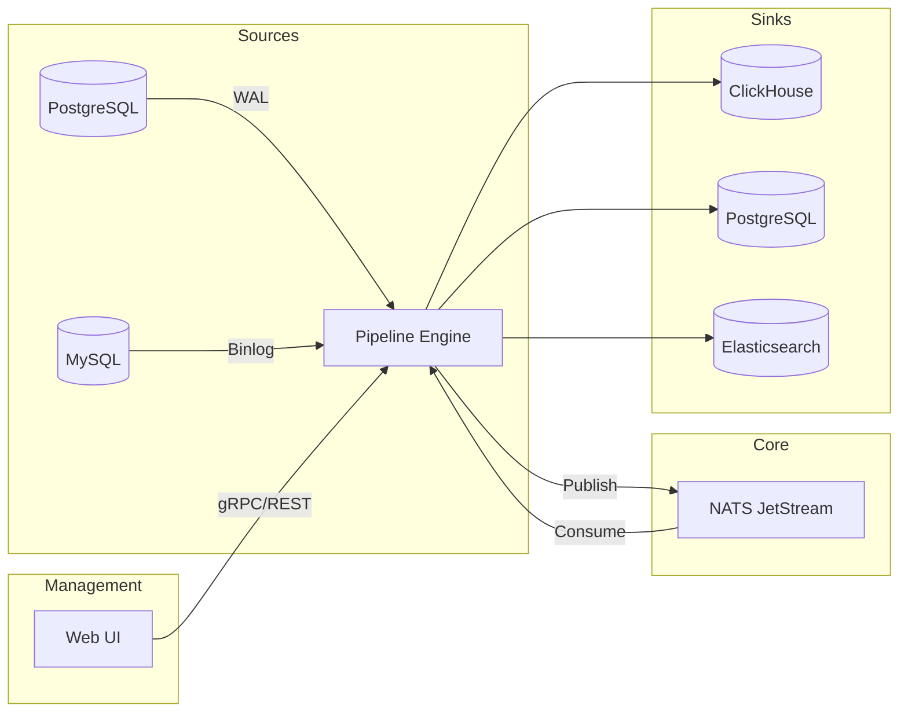

# CDC


[](LICENSE)
[](https://github.com/foden303/cdc/stargazers)

## Overview

A real-time Change Data Capture system built with Go. It captures data changes from databases via WAL/Binlog, routes them through NATS JetStream, and delivers to various destinations. All sources and sinks are managed dynamically through the Web UI — no manual config files needed.

## Tech Stack

| Layer | Technology |
|-------|-----------|
| Backend | Go 1.25, gRPC, grpc-gateway |
| Message Broker | NATS JetStream |
| Transformations | Google CEL |
| Metrics | Prometheus |
| Frontend | React 19, Vite, TypeScript, Tailwind CSS, shadcn/ui |
| State Management | Zustand, TanStack Query |

## Architecture


```mermaid
graph LR
    subgraph Sources
        PG[(PostgreSQL)] -->|WAL| Engine
        MySQL[(MySQL)] -->|Binlog| Engine
    end

    subgraph Core
        Engine[Pipeline Engine] -->|Publish| NATS[NATS JetStream]
        NATS -->|Consume| Engine
    end

    subgraph Sinks
        Engine --> ClickHouse[(ClickHouse)]
        Engine --> PG2[(PostgreSQL)]
        Engine --> ES[(Elasticsearch)]
    end

    subgraph Management
        UI[Web UI] -->|gRPC/REST| Engine
    end
```

## Features

- **Sources**: PostgreSQL (WAL logical replication), MySQL/MariaDB (Binlog)
- **Sinks**: ClickHouse, PostgreSQL, Elasticsearch
- **Pipeline**: CEL-based filtering & transformation, N-to-N routing, partition-aware consumers
- **Delivery**: At-least-once delivery, idempotent writes where sink keys support it, Dead Letter Queue, configurable batching & retries
- **Management**: gRPC + REST API, Web UI dashboard, schema discovery, message explorer
- **Observability**: Prometheus metrics, structured logging, health checks

## Quick Start

## Delivery Guarantees

| Area | Current guarantee |
|------|-------------------|
| Source to NATS | Events are retried until published to JetStream. Source WAL/binlog resume is tracked separately from flow checkpoints. |
| NATS to sink | At-least-once. A sink write may be retried, so sinks should use primary keys/upserts or another idempotency strategy. |
| Checkpointing | Flow checkpoints are saved per flow/source/table/partition after sink write and NATS ACK succeed. |
| Exactly-once | Not claimed end-to-end. Duplicate delivery is possible during retries, reconnects, and recovery. |

### Run

```bash
# Start infrastructure (NATS + Prometheus)
make up

# Generate gRPC stubs
make gen-proto

# Build & run the CDC service
make run

# Start the Web UI
make fe-install
make fe-dev
```

Services:
- gRPC API → `:9090`
- REST API → `:9091`
- Web UI → `:5173`

### All Commands

```bash
make build        # Build binary
make run          # Build & run
make test         # Run tests
make tidy         # go mod tidy
make gen-proto    # Regenerate protobuf
make up / down    # Docker infra up/down
make fe-install   # Install frontend deps
make fe-dev       # Run frontend dev server
make fe-build     # Build frontend
make fe-lint      # Lint frontend
```
